# Customer journey walk-through

End-to-end UX review of the DarInsights flow, from "first-time visitor" to "active power user." Captures were generated by walking the seeded `Acme Bakery` demo workspace as `pro-test@example.com`. Re-generate with:

```bash
PYTHONPATH=. python scripts/seed_help_workspace.py
PYTHONPATH=. python scripts/seed_help_audit_data.py
PORT=5002 python scripts/capture_customer_journey.py
```

The walk-through is grouped into seven stages. Each step has the screenshot, what the user sees, and a one-line UX note for the team to react to.

---

## Stage 1 · Discovery & sign-up

The first three minutes. Does the value prop land, and is the path to sign up obvious?

### 1. Landing page

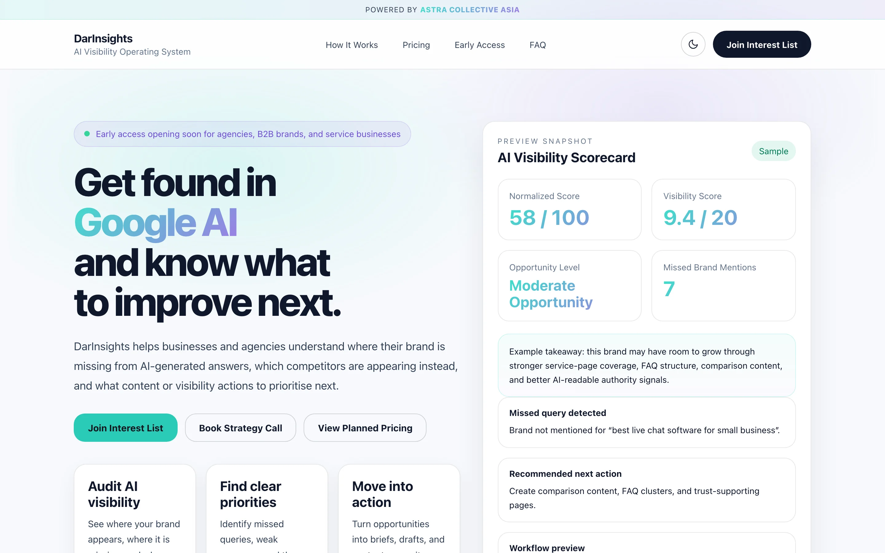

**Public marketing site.** Hero promises "find out what AI search says about your brand," with a sample scorecard inline as proof.

**UX note:** Hero copy is clear. Two CTAs ("Join Interest List" + "Book Strategy Call") compete — could the team decide on a primary one?

### 2. Pricing

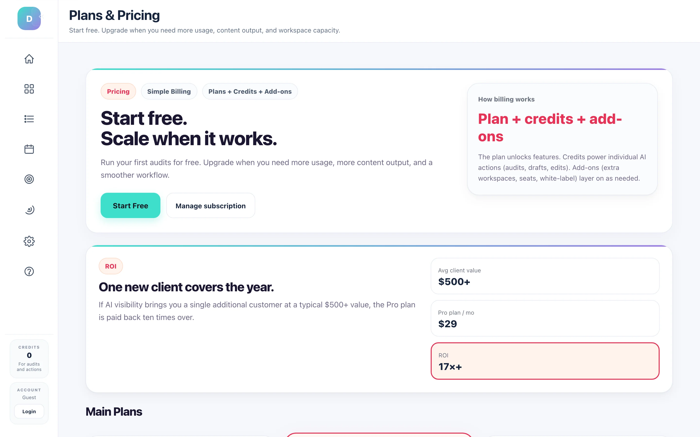

**Plan tiers + credit bundles** on a single scroll. Logged-out users see "Sign up to start."

**UX note:** Are the plan differences scannable at a glance, or do most prospects need to read the small print?

### 3. Sign up

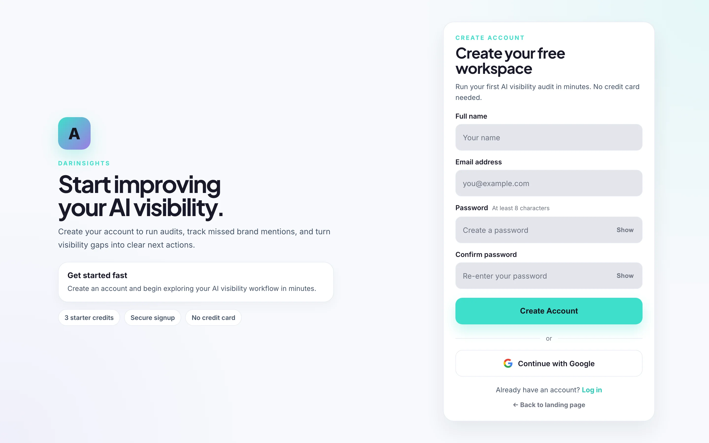

**Email/password vs. Google.** Both are first-class.

**UX note:** Order matters — most modern apps put Google first because it's a one-click path. Worth A/B?

### 4. Log in

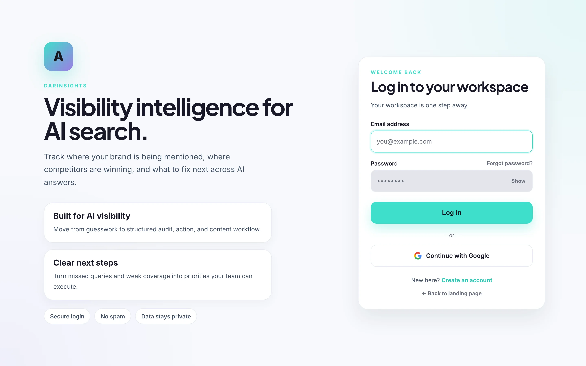

**Returning users.** "Forgot password?" sits inline with the password field — discoverable.

**UX note:** Solid. The minor copy ("Welcome back" vs. specific brand) is a nit.

---

## Stage 2 · First workspace

The first time the user puts the product to work. Activation hinges on these screens.

### 5. Workspaces list

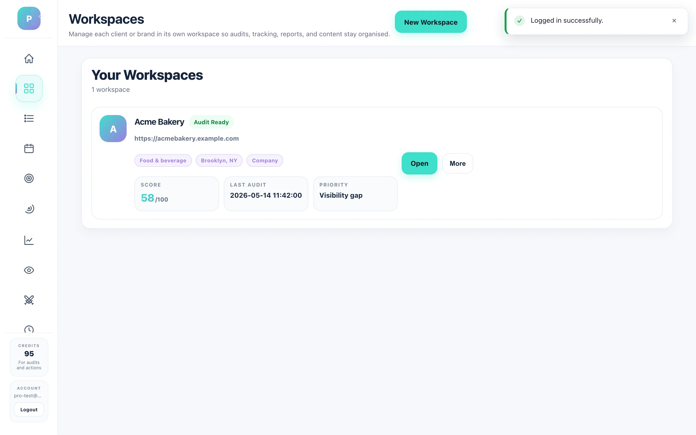

**The hub for returning users.** Each tile links into the workspace.

**UX note:** Empty-state for first-time users isn't pictured — the new-user redirect lands them on the workspace form directly (step 6), skipping this view.

### 6. Add a workspace

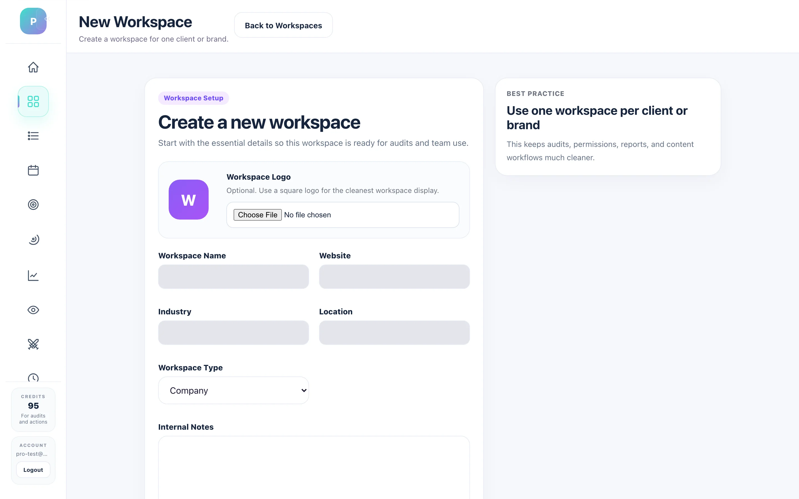

**First-run mode** — only name + website are required. Industry / location are tucked behind a disclosure to keep first-touch friction low.

**UX note:** Disclosure is fine but invisible until expanded. The audit quality is materially better when industry + location are filled — should we hint that?

### 7. Brand context

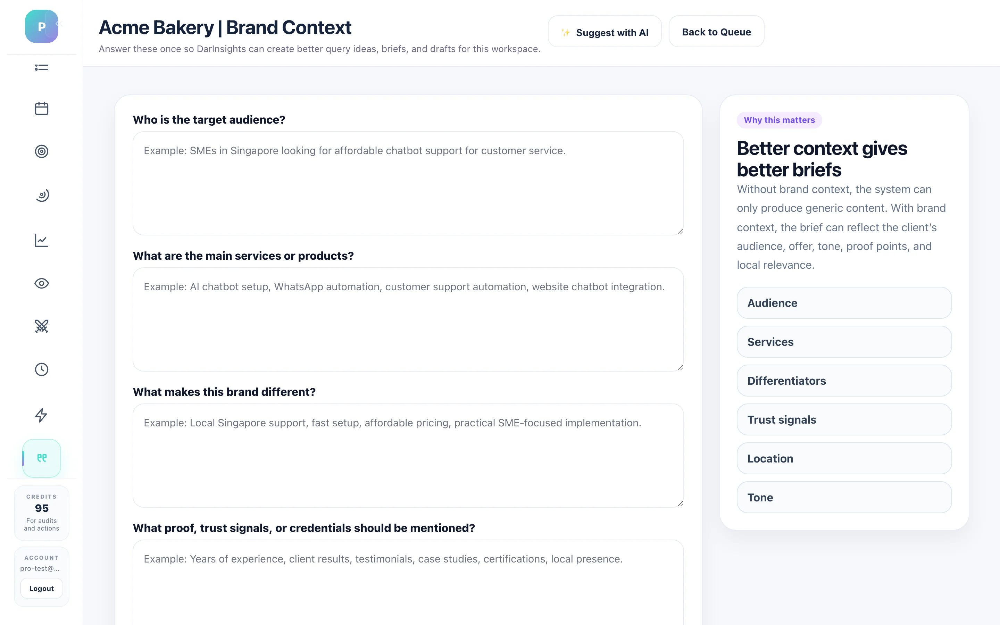

**Optional soft step** between workspace creation and the first audit. "Suggest from website" can auto-fill from the URL.

**UX note:** Skipping this is allowed but materially worse downstream (briefs / drafts feel generic). The skip link should probably warn that.

### 8. Brand kit studio

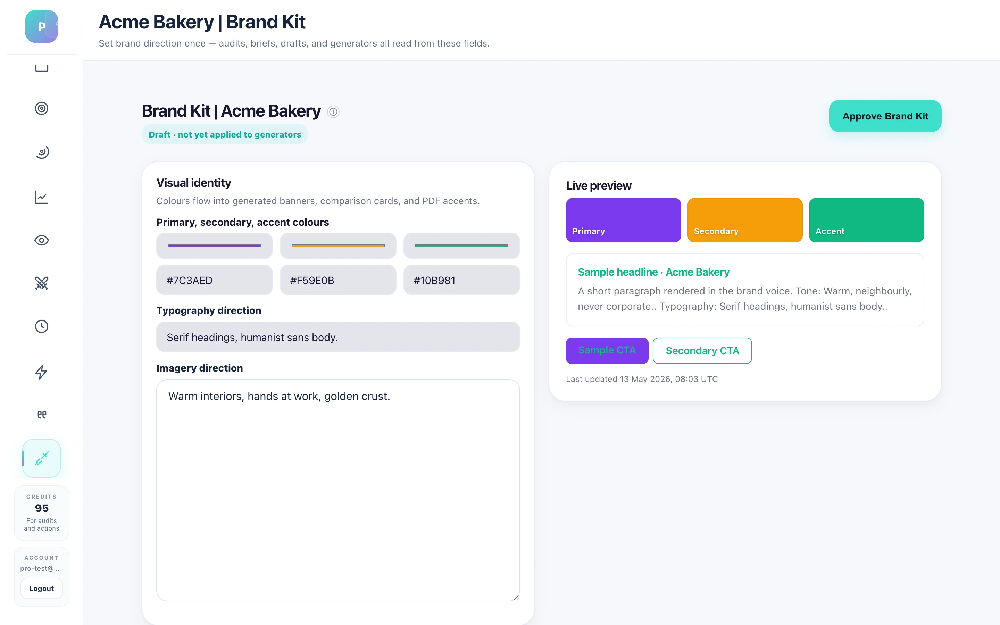

**Colors + typography**, used by generated pages and visuals.

**UX note:** Often overlooked because it lives one level deep. Could surface a "Approve brand kit" badge on the workspace overview.

---

## Stage 3 · First audit

The moment that delivers (or doesn't deliver) the "aha."

### 9. Launch an audit

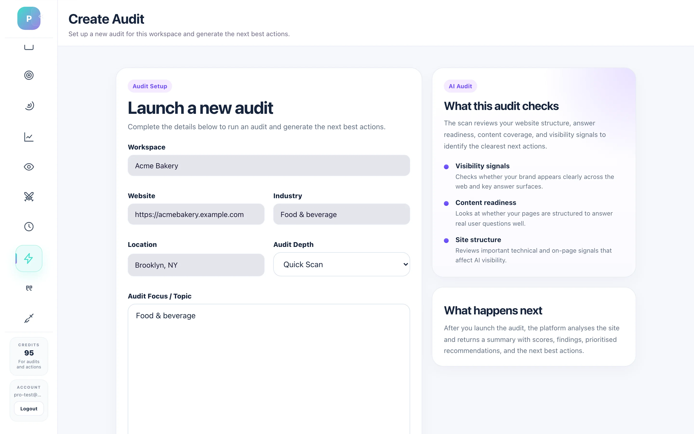

**One-screen confirmation.** Industry + topic are pre-filled from the workspace.

**UX note:** "What this audit checks" + "What happens next" copy is good — sets expectations during the ~2-minute wait.

### 10. Workspace overview (post-audit)

> ⚠ **Capture skipped** — this page hit a `RuntimeError: The current Flask app is not registered with this SQLAlchemy instance` in the local dev environment when its handler calls `get_queue_items()`. The page renders fine in production. Reviewers can see the populated state on the help center: [Workspace overview screenshot in the help center](../../static/images/help/workspace-overview.webp).

**The hub.** Score, "Next Best Step," priorities, content opportunities, integrations.

**UX note:** This is where activation either happens or doesn't. The "Next Best Step" card is the single most important affordance in the product — make sure it's always populated even for the first audit.

### 11. Visibility

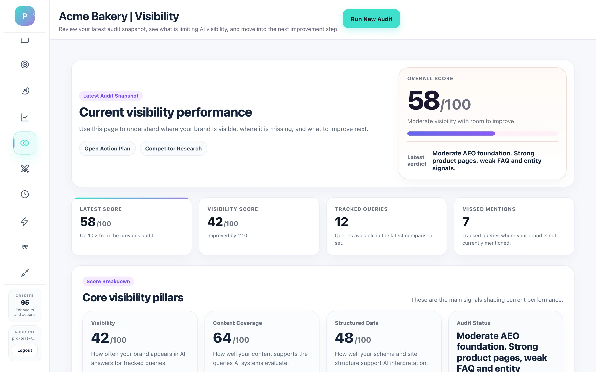

**Per-query state.** The seeded audit shows 58/100 with "Up 10.2 from previous", 12 tracked queries, 7 missed mentions, plus a sub-score breakdown.

**UX note:** Clear. The delta vs. previous audit makes the page feel alive.

---

## Stage 4 · Insight & response

The bridge from "we know what's wrong" to "we did something about it."

### 12. Competitor gaps

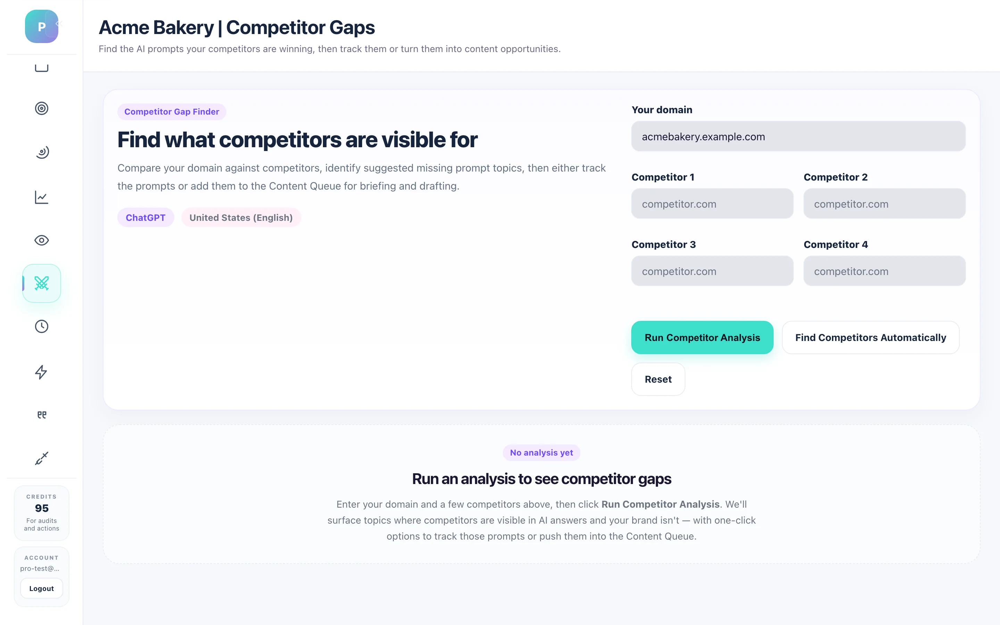

**Find what competitors are visible for.** The empty state nudges "Run Competitor Analysis."

**UX note:** Empty by default because it requires a second action. Consider auto-running on workspace creation for higher-tier plans.

### 13. Audit history

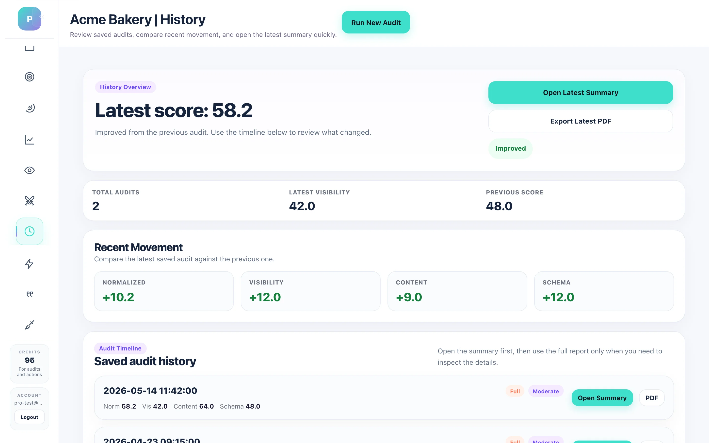

**Returning users.** Latest score 58.2, up 10.2 from previous. Full delta breakdown: +12 visibility, +9 content, +12 schema.

**UX note:** The delta blocks are the best "progress over time" surface in the product. Could be promoted to the dashboard.

### 14. Content brief

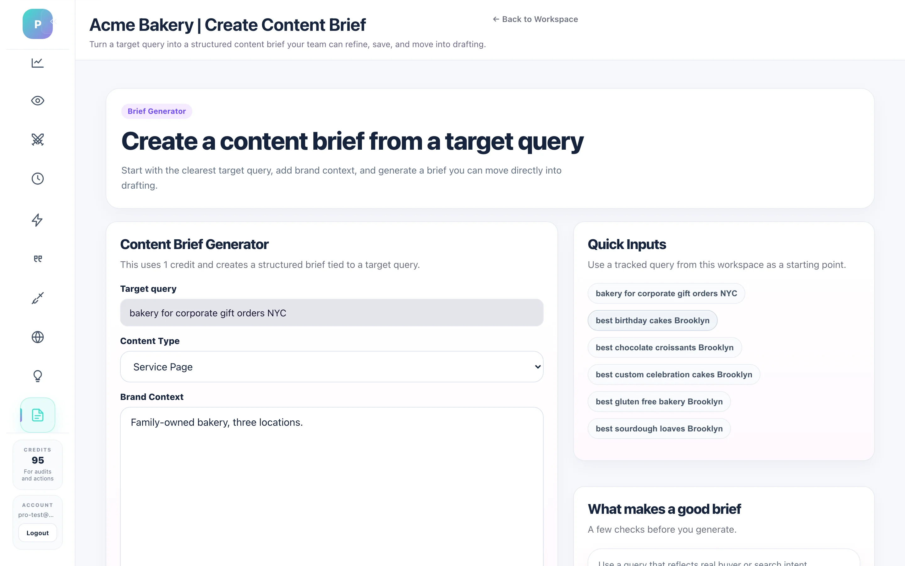

**Pick a query → generate a structured brief.** Tone, target page type, output options all in one form.

**UX note:** This is the path from "I see the gap" to "I'm filling the gap." Should be the primary CTA on every priority card.

---

## Stage 5 · Production & retention

Where the team actually ships content and the user comes back.

### 15. Content queue

> ⚠ **Capture skipped** — same dev-env error as step 10. Production renders correctly; see the help center's [content queue screenshot](../../static/images/help/content-queue.webp).

**Briefs and drafts in flight.** Approve, AI-edit, generate visual, publish from here.

**UX note:** The publish destinations (Webflow / Wix / Framer / Shopify / Squarespace) are the moment the product proves ROI — make sure failure cases are loud, not silent.

### 16. Growth calendar

> ⚠ **Capture skipped** — same dev-env error.

**4-week schedule** built from the latest audit. Each recommendation card schedules into a target week.

**UX note:** Auto-refresh when content goes stale is a delight if it works, churn risk if it surprises the user. Worth a tooltip on the refresh behaviour.

### 17. Position tracking

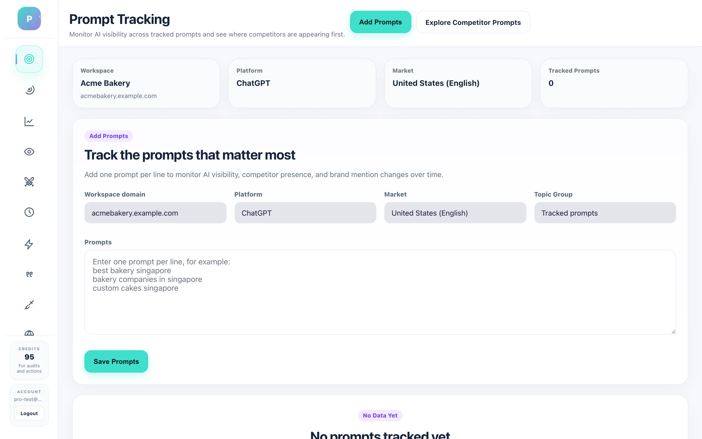

**Score and per-query movement** across audits over time.

**UX note:** Empty when there's only one audit. Encourage a second audit explicitly here.

### 18. Answer monitor

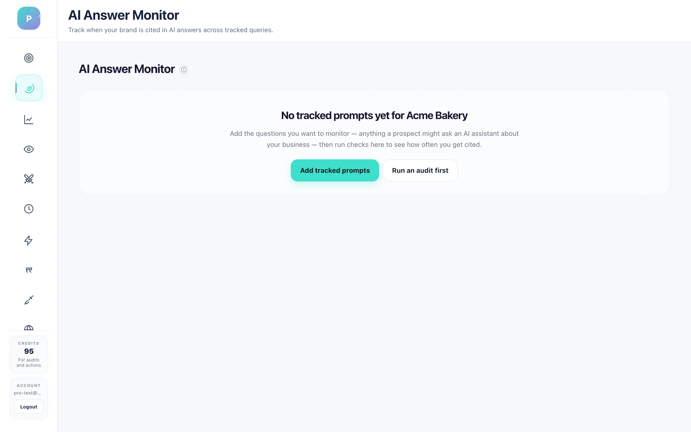

**Re-run individual prompts** between audits. Tracks "last seen" + new AI answer per prompt.

**UX note:** Power-user surface. Currently buried — could be a card on the workspace overview after the first audit.

---

## Stage 6 · Conversion & scale

The moments where free users become paying users, and single users become teams.

### 19. Pricing (logged in)

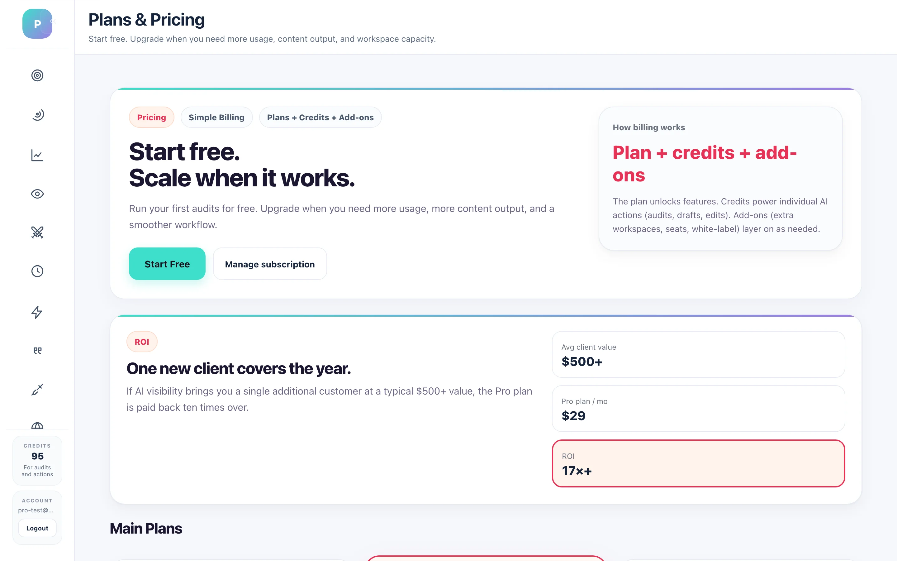

**Same page as step 2** but authenticated. The CTAs shift to "Subscribe / Upgrade."

**UX note:** Compare side by side with the public version (step 2) — is the change in tone clear enough to feel personalised?

### 20. Settings → Billing

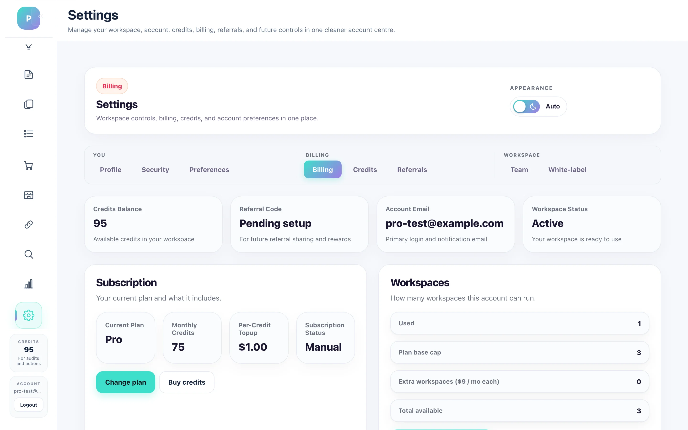

**Plan + Stripe portal + workspace seats.** Add a seat or open Stripe from here.

**UX note:** Stripe portal is hosted off-site. Make sure the in-app preview matches what users will actually see in Stripe.

### 21. Settings → Credits

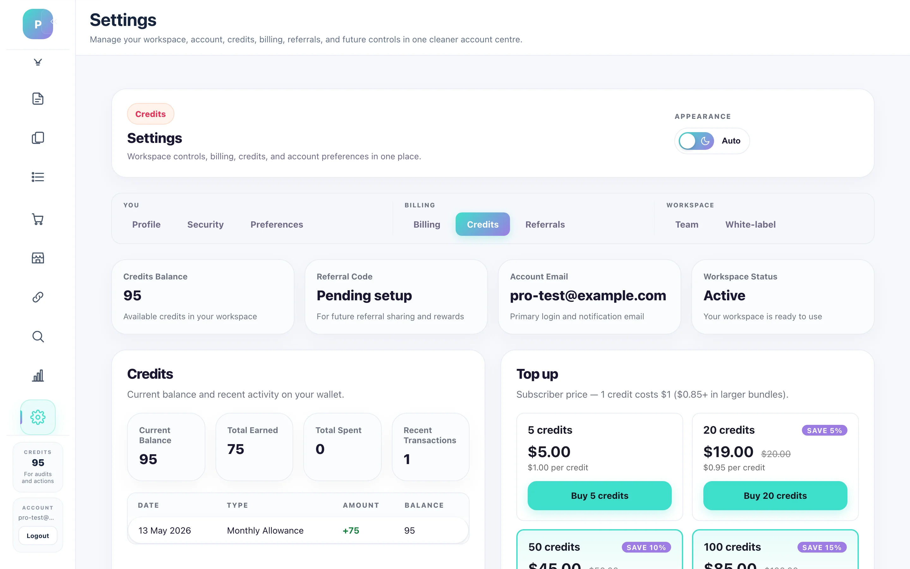

**Top up the wallet** without changing plan. Bundles never expire.

**UX note:** "Bundles never expire" is a great value prop — is it called out elsewhere in the product (e.g., when credits run low)?

### 22. Settings → Team

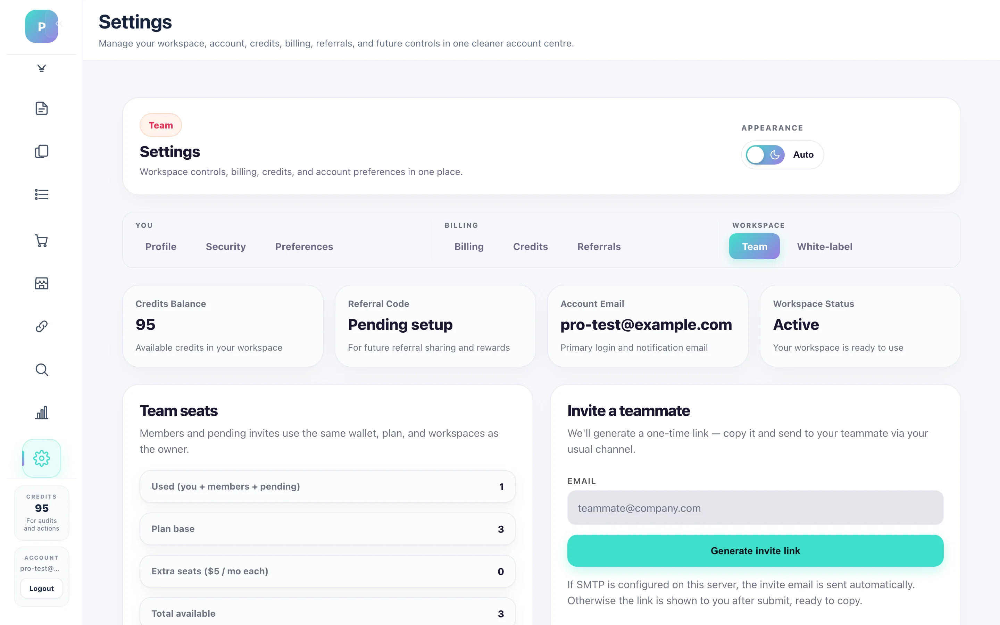

**Invite teammates, manage seats.** Each seat consumes one slot.

**UX note:** The relationship between team seats and workspace seats is a common confusion point — the glossary in the help center spells it out, but in-product copy could too.

### 23. Settings → White-label

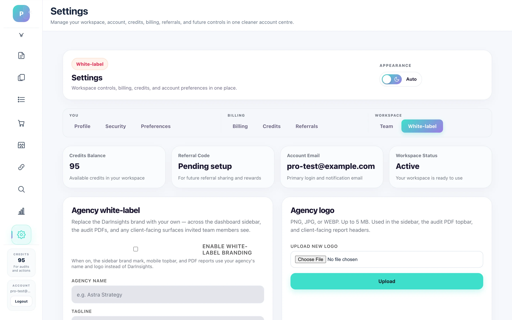

**Logo + brand colour** applied to public reports + PDFs. Plan-gated.

**UX note:** This is the moment agencies validate the product is for them. Surface a "preview as client" CTA right next to the save button.

---

## Stage 7 · Self-serve

When the user is stuck and looking for help.

### 24. Help center

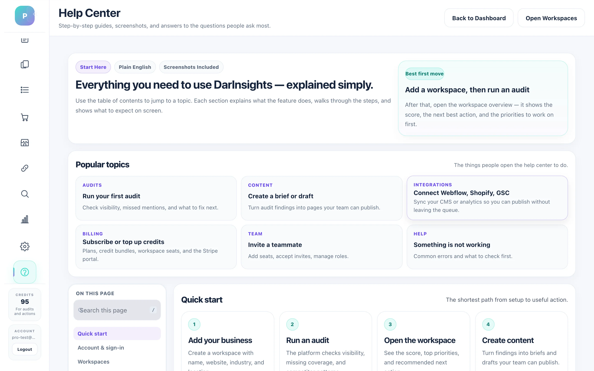

**Sectioned guides, FAQ, popular topics, search.** Wired into the sidebar nav.

**UX note:** Discoverability of `/help` itself is the open question — sidebar icon, but no contextual nudge from other screens. Consider an in-line "?" hint on first-run pages.

---

## Summary of gaps for the team

**Capture-blocked (dev-env only — production renders fine):**
- Step 10: Workspace overview
- Step 15: Content queue
- Step 16: Growth calendar

All three crash with the same `RuntimeError: The current Flask app is not registered with this SQLAlchemy instance` when their request handlers call `get_queue_items()`. The function works in isolation (verified via `app_context()`), so this looks like a Flask debug-reloader artifact rather than a real bug — but worth flagging in case anyone else can reproduce it consistently.

**UX observations worth a follow-up discussion** (rolled up from the per-step notes):

1. Two competing landing CTAs (step 1).
2. Sign-up button order — Google second vs. first (step 3).
3. First-workspace disclosure hides industry/location, which matters for audit quality (step 6).
4. Skipping brand context degrades downstream quality but isn't warned about (step 7).
5. Brand kit lives one level deep — surfacing approval on the workspace overview would help (step 8).
6. "Next Best Step" on the workspace overview is the single most important affordance — must always be populated (step 10).
7. Auto-run competitor analysis on higher tiers (step 12).
8. The audit-history delta breakdown is the best "progress" surface — promote it to dashboard (step 13).
9. Make "Create brief" the primary CTA on priority cards (step 14).
10. Surface answer-monitor on the workspace overview (step 18).
11. Confusion between team seats and workspace seats (step 22).
12. White-label needs a "preview as client" affordance (step 23).
13. `/help` discoverability — add an inline "?" on first-run pages (step 24).

---

_Generated by [scripts/capture_customer_journey.py](../../scripts/capture_customer_journey.py). Re-run after any UX change touching the listed routes — about 3 minutes end-to-end._
